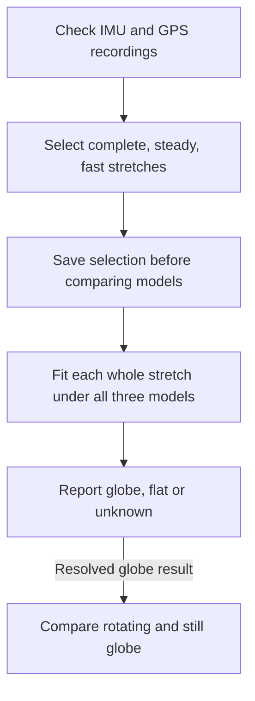

# Local Level Lab

**Can aircraft motion measurements distinguish a globe from a flat surface—and, if they
favor a globe, show whether it rotates?**

Local Level Lab analyzes NASA airborne survey recordings to investigate that question.
The data come from professional inertial equipment and GPS receivers aboard research aircraft.
A proposed crowdsourced experiment using smaller, less expensive instruments is secondary work.
The code, selection criteria and analysis records are open for review.

An **IMU (inertial measurement unit)** measures turning and acceleration. Its gyroscopes
measure how it turns; its accelerometers measure forces associated with gravity and motion.
GPS records where the aircraft went and when.

## The idea

An aircraft staying level over a globe must gradually turn as it follows the curved surface:
the direction of local down changes along its route. At 900 km/h, that curvature corresponds
to roughly eight degrees of turning per hour. Earth's rotation adds a different contribution.
An IMU can measure both, alongside ordinary aircraft movements and instrument errors.

| Model | Predicted contributions |
|---|---|
| Rotating globe | Turning along the curved surface, Earth's rotation and aircraft maneuvers. |
| Still globe | Turning along the curved surface and aircraft maneuvers, without Earth's rotation. |
| Still flat disc | Aircraft maneuvers and changes of direction around the disc, without globe curvature or Earth's rotation. |

The first question is **globe, flat or unknown**. All three models are fitted together,
comparing the flat model with whichever globe model fits better. Rotation is reported only
after the shape comparison consistently favors a globe; that comparison reuses the globe fits.

A persistent gyro reading alone proves little. Instrument offsets, aircraft motion and
uncertain onboard corrections can imitate parts of the signal. Those effects must be
allowed fairly across all models. This tests the specified models, rather than every
possible description of a flat Earth.

## Primary work: NASA airborne data

These recordings supported NASA's Operation IceBridge lidar surveys of ice sheets,
glaciers and sea ice. LVIS, the Land, Vegetation, and Ice Sensor, measures laser returns
from the surface. GPS locates the aircraft and the IMU tracks its orientation so those
returns can become accurately positioned elevation maps. See [NASA's LVIS description](https://lvis.gsfc.nasa.gov/Home/index.html).

The raw recordings are source material underlying those finished survey products.
Reliable survey maps depend on reliable measurements, calibration and processing. This
project uses the archived IMU measurements themselves to compare Earth models, rather
than using the survey's finished navigation answer as evidence.

The ILVIS0 archive contains **survey-grade Applanix IMU recordings with embedded GPS**.
These instruments were built for precision airborne mapping and are far more capable
than phone IMUs. Their published capabilities make slow turning at degrees per hour a
credible measurement target. The reference instrument is a POS AV 510; other recorded
configurations are decoded and assessed separately.

The analysis preserves original measurements and timestamps, checks packet integrity,
and verifies units against the instrument's combined GPS/IMU navigation output. That
combined output supplies decoder checks and motion context, rather than independent
evidence about Earth's shape. The model fits use IMU increments and receiver positions.

Here, **raw** means the recorded angle and velocity increments, before the finished
navigation solution. It does not mean that the electronics applied no calibration or
filtering. Ordinary noise filtering can preserve slow turning. Automatic zeroing or
subtracting Earth's rotation can remove it, so the analysis also tests possible
Earth-rate removal. Passing a numerical fit does not identify which onboard processing
was used.

The current selection requires **four continuous minutes** with every supported GPS
ground-speed reading at least **700 km/h**, plus limits on aircraft motion, gaps and
instrument changes. Selection is fixed before examining model preferences. Each whole
stretch is fitted jointly; shorter sections check consistency without becoming extra
flights or receiving separate calibration fits.

The [public selection record](docs/ilvis0-highspeed-segments-20261008/ELIGIBILITY.md)
links to every eligible interval and every file's screening outcome.
See the [methodology](docs/METHODOLOGY.md) for the reasoning and the
[archive guide](docs/ILVIS0.md) for instruments, decoding and remaining uncertainties.

## Current status

**The completed comparisons favor a rotating globe. None has a completed preference
for the specified flat disc.** As of 10 October 2026, all 53 selected stretches have been analyzed.

- All **232 retained files** have been screened: **53 qualifying stretches, totaling
  424.3 minutes**. Some instrument streams overlap; these are not 53 independent flights.
- **12 stretches favor globe over flat under both processing assumptions.** All 12 also
  favor rotating over still globe. None has a resolved flat preference; 41 remain unknown
  because required calculations did not pass the numerical stopping checks.
  [Findings and source data](docs/ilvis0-highspeed-segments-20261008/FINDINGS.md) explain
  the complete and partial comparisons and link to every source recording and track.
- **The pilot's resolved comparisons favor globe.** Two recordings favored globe over
  flat, then rotating over still globe, under all four tested cases. Two other recordings
  have globe-favoring partial shape comparisons; two have no completed shape comparison.
  **None of the six has a resolved preference for flat.**
  [Provisional pilot findings](docs/ilvis0-refinement-20261008/PROVISIONAL.md) explain the results.
- The larger analysis tests two processing assumptions: Earth's rotation was retained
  in the logged measurements, or a shared amount may have been removed onboard.
  Both allow a constant gyro offset of ±1 degree/hour. This is the analysis's offset
  allowance; it is not a claim that these instruments drift by that amount.

**Converged** means the solver satisfied numerical stopping and stationarity checks.
It measures whether a calculation finished, not whether its model matched the data well.
A flat-disc calculation can converge while fitting the flight much worse than a globe.
The 41 unknown results mean **the comparison could not be completed**, not that globe
and flat received equal support. Missing calculations are not evidence for either shape.

The [saved-result diagnosis](docs/ilvis0-highspeed-segments-20261008/POST_RUN_REVIEW.md)
found that most unresolved calculations exhausted their numerical allowance. A
[small matched refinement](docs/ilvis0-solver-trial-20261010/README.md)
is running to test whether more comparisons can finish under the same physical assumptions.

The remaining checks concern numerical completion, fits reaching allowed calibration
limits, and the exact timing and corrections used in the logs. Published hardware
specifications provide useful performance context; these checks determine how confidently
we can quantify the model differences. The current study reports which model fits better,
without assigning a validated statistical significance level. The completed results and
preselected intervals remain preserved.

The [analysis roadmap](docs/ANALYSIS_ROADMAP.md) puts calibration-boundary diagnosis,
absolute fit quality and timing/GPS sensitivity next. Exact device characterization
continues in parallel at lower priority; modeling does not wait for it. A separate
[rotation-field study](docs/ROTATION_FIELD.md) is planned to estimate the background
vector before interpreting its cause.

## Secondary work: a crowdsourced experiment

An Android app records an external WitMotion WT901-family IMU over Bluetooth, phone GPS
and flight details. The proposed protocol uses still measurements before and after flying,
secure mounting, and deliberate IMU reversals during suitable cruise periods. Reversals
help separate external rotation from instrument offsets.

The recording software and analysis tools are implemented. Real-device bench tests and
a validated passenger-flight procedure are still needed. Simulations have exposed difficulties
with wind, aircraft motion and changing instrument errors. NASA results cannot automatically
establish what consumer IMUs can measure.

See the [participant protocol](docs/PROTOCOL.md), [instrument tests](docs/BENCH.md) and
[validation guide](docs/VALIDATION.md). Follow airline rules and crew instructions.
Uploading requires consent to public release; read the [privacy policy](PRIVACY.md).

## Explore or contribute

[Developer setup](docs/DEVELOPMENT.md) covers the app, Python analysis and upload server.
[Contributing](CONTRIBUTING.md) explains how to help. Reviews of the physics, statistics,
instrument behavior and explanations are welcome.

Code uses AGPL-3.0-or-later. Published participant recordings use CC0; third-party data
retain their own terms. See [data licensing](DATA_LICENSE.md).
Local Level Lab is an [Ars Astronomica](https://arsastronomica.com) project.
