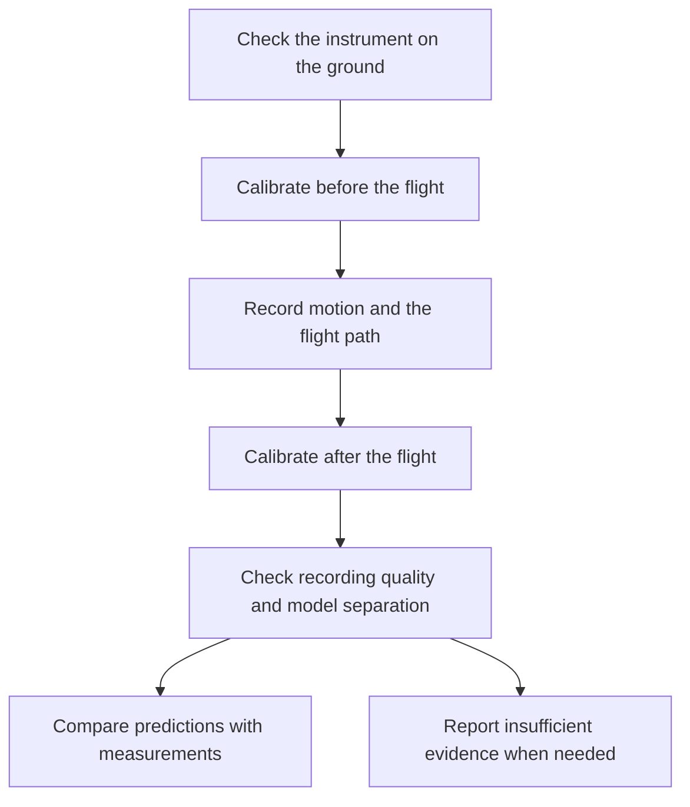

# Local Level Lab

An **IMU (inertial measurement unit)** is a device that measures motion. Its gyroscope measures
turning; its accelerometer measures acceleration and helps determine which way is down. The
IMUs used here also include a magnetic compass. An Android phone records the IMU over Bluetooth
and uses GPS to record the flight path.

**The idea:** an airplane moving at speed during steady, level flight should produce a small,
consistent rotation reading in the IMU that depends on the shape and motion of the Earth.
Local Level Lab aims to measure that signal with a consumer-grade IMU, or a better one, and
use it to distinguish three specific models: a rotating globe, a stationary globe and a
stationary flat disc. The recordings, code and reasoning are open for anyone to check.

**The recording app and analysis tools are implemented. Scientific validation is incomplete.**
The project has tested its software extensively with simulated flights, but has no real IMU
bench measurements yet. It has not established how rarely its final method would wrongly reject
an Earth model that is actually correct.

## Why should level flight produce a rotation reading?

Level flight feels straight and steady to a passenger. On a globe, however, the aircraft has to
keep changing its orientation to follow the curved surface. What counts as down changes as
it travels. An IMU can register that slow turning even while the aircraft stays level locally.
At 900 km/h, the curvature contribution is about eight degrees of rotation per hour.

If the Earth also rotates, that adds another contribution to the IMU reading. On a stationary
globe, the curvature contribution remains but the Earth-rotation contribution is absent.
On a stationary flat disc, the curvature tilt is absent. Travel around that disc can still
change direction, and the flat model includes that movement in its prediction.

| Model | What contributes to the predicted IMU reading? |
|---|---|
| Rotating globe | Earth rotation, plus the change of orientation as the aircraft follows the curved surface. |
| Stationary globe | The change of orientation over the curved surface, without Earth rotation. |
| Stationary flat disc | Changes of direction around the disc, without the curvature tilt or Earth rotation. |

These are different patterns of turning, along different axes, on the same route. GPS supplies
positions and times for the predictions; the IMU supplies the independent motion measurement.
The goal is to tell all three patterns apart reliably, including plausible measurement errors.
The current project has not yet demonstrated that full separation with real IMUs.

This tests those particular motion predictions. It does not test every conceivable model of
the Earth. In particular, this setup cannot reliably distinguish a steadily spinning disc
from an error in the IMU itself.

## How the experiment works

The useful signal is small. Temperature, IMU drift, a loose mount and the aircraft pointing
slightly across the wind can imitate or obscure it. Recording for a long time is not enough:
the route and IMU movements must provide a way to separate these effects.

An IMU also has its own **bias**: a small reading that comes from measurement error rather
than real turning. The experiment has to distinguish that error from the steady, model-dependent
flight signal. Detecting a nonzero reading by itself does not distinguish the Earth models.

Before and after flying, the operator places the IMU in a sequence of still positions.
During cruise, it stays firmly mounted. At suitable moments the operator turns it to face
the opposite way, keeping the same side up. This changes how a real external rotation appears
in the IMU while some of its own errors stay the same. That helps the analysis separate them.

The software checks for missing data, uncertain orientation and possible mount movement.
It uses steady cruise rather than treating every aircraft maneuver as useful evidence.
It then asks whether the remaining measurements can distinguish the models even after allowing
for plausible IMU and aircraft effects. A flight can be recorded successfully and still
be unable to answer the scientific question.

Repeated flights must also be handled carefully. Recordings from the same physical IMU
share its quirks; they cannot be counted as completely independent instruments. Combining
partial comparisons across flights is implemented experimentally and still needs validation.

The [methodology guide](docs/METHODOLOGY.md) explains these choices in more detail.

## Where things stand

The Android app records an external IMU over Bluetooth, saves phone GPS and flight details,
guides calibration, and can share or upload a recording. The analysis and upload server work
with these recordings. The project currently targets the WitMotion WT901SDCL family, with
support for the two documented Bluetooth variants. Each physical unit still needs testing.

Two development campaigns of 1,000 simulated flights each are complete. They exercised the
analysis under changing IMU errors and wind. They do not establish that real instruments
will behave the same way, or that the final statistical decisions are trustworthy.

More recent tests asked which routes and IMU-turn schedules remain informative under
several descriptions of wind and IMU error. A 300-case study found no route that passed
all required comparisons. An audit corrected a numerical defect and exposed problems with
short cruise legs, changing IMU error and turn timing. A further 72-case comparison finished,
but neither the old nor revised schedule passed every comparison. These are useful failures:
they show what the experimental design still has to solve.

Readable summaries are in [Evidence so far](docs/EVIDENCE.md) and
[What still needs validation](docs/VALIDATION.md).

## What is needed next?

First, establish a practical flight and IMU-turn pattern that keeps the models distinguishable
after the full recording and analysis process. The latest tests show that a promising simplified
calculation can fail once aircraft motion and IMU orientation are reconstructed from recordings.

Real instruments must then demonstrate that they preserve slow rotation, remain stable, and
produce repeatable measurements. The [bench-testing guide](docs/BENCH.md) describes the checks.

Before making strong statistical claims, the final method must be fixed in advance. One fresh
simulation campaign will set its decision thresholds. A separate campaign must then test how
often it makes a wrong decision. Changing the method after seeing those tests would require
another validation. Earlier development runs cannot substitute for that independent check.

## Recording a flight

Start with the [participant guide](docs/PROTOCOL.md). It covers instrument checks, calibration,
mounting, flight details and saving a complete recording. A rigid mount is essential; an
unsecured IMU can slowly move in a way that resembles the signal being studied.

If phone GPS is unavailable, the app can continue recording the IMU after acknowledgment.
The airline, flight number and scheduled departure date help locate a public track later.
Such a track may help check GPS or recover the route, but that replacement is not yet supported
by a validated analysis method. A downloaded position track supplies no IMU measurements.

Follow crew instructions and airline rules on devices and mounting.

## Checking or contributing to the work

All source code is open. The original uploaded recordings are published so another person can
rerun the analysis or challenge it. Uploading requires explicit consent to permanent public
release; recordings include location and identifying flight information. Read the
[privacy policy](PRIVACY.md) before uploading.

The repository contains the Android app, Python analysis tools, upload server and documentation.
[Developer setup](docs/DEVELOPMENT.md) has commands and build instructions.
[Contributing](CONTRIBUTING.md) describes how to help. Reviews of the physics, statistics,
instrument behavior and explanations are welcome.

Code is licensed under AGPL-3.0-or-later. Published recordings use CC0; the bundled airline
directory and downloaded third-party tracks have separate terms. See [data licensing](DATA_LICENSE.md).

Local Level Lab is an [Ars Astronomica](https://arsastronomica.com) project.
