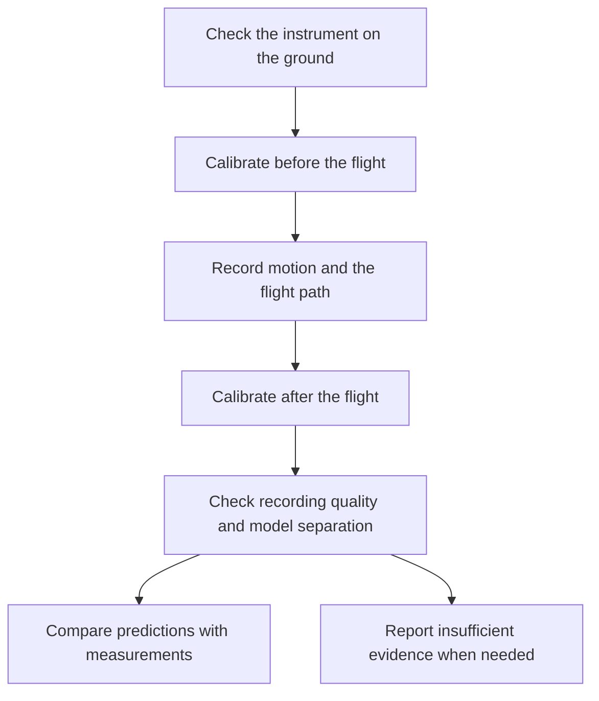

# Local Level Lab

An **IMU (inertial measurement unit)** is a device that measures motion. Its gyroscope measures
turning; its accelerometer measures acceleration and helps determine which way is down. The
IMUs used here also include a magnetic compass. An Android phone records the IMU over Bluetooth
and uses GPS to record the flight path.

**The idea:** an airplane moving at speed during steady, level flight should produce a small,
consistent rotation reading in the IMU that depends on the shape and motion of the Earth.
Local Level Lab aims to measure that signal with a consumer-grade IMU, or a better one, and
use it to distinguish three specific models: a rotating globe, a stationary globe and a
stationary flat disc. The recordings, code and reasoning are open for anyone to check.

**The recording app and analysis tools are implemented. Scientific validation is incomplete.**
The project has tested its software extensively with simulated flights, but has no real IMU
bench measurements yet. It has not established how rarely its final method would wrongly reject
an Earth model that is actually correct.

## Why should level flight produce a rotation reading?

Level flight feels straight and steady to a passenger. On a globe, however, the aircraft has to
keep changing its orientation to follow the curved surface. What counts as down changes as
it travels. An IMU can register that slow turning even while the aircraft stays level locally.
At 900 km/h, the curvature contribution is about eight degrees of rotation per hour.

If the Earth also rotates, that adds another contribution to the IMU reading. On a stationary
globe, the curvature contribution remains but the Earth-rotation contribution is absent.
On a stationary flat disc, the curvature tilt is absent. Travel around that disc can still
change direction, and the flat model includes that movement in its prediction.

| Model | What contributes to the predicted IMU reading? |
|---|---|
| Rotating globe | Earth rotation, plus the change of orientation as the aircraft follows the curved surface. |
| Stationary globe | The change of orientation over the curved surface, without Earth rotation. |
| Stationary flat disc | Changes of direction around the disc, without the curvature tilt or Earth rotation. |

These are different patterns of turning, along different axes, on the same route. GPS supplies
positions and times for the predictions; the IMU supplies the independent motion measurement.
The goal is to tell all three patterns apart reliably, including plausible measurement errors.
The current project has not yet demonstrated that full separation with real IMUs.

This tests those particular motion predictions. It does not test every conceivable model of
the Earth. In particular, this setup cannot reliably distinguish a steadily spinning disc
from an error in the IMU itself.

## How the experiment works

The useful signal is small. Temperature, IMU drift, a loose mount and the aircraft pointing
slightly across the wind can imitate or obscure it. Recording for a long time is not enough:
the route and IMU movements must provide a way to separate these effects.

An IMU also has its own **bias**: a small reading that comes from measurement error rather
than real turning. The experiment has to distinguish that error from the steady, model-dependent
flight signal. Detecting a nonzero reading by itself does not distinguish the Earth models.

Before and after flying, the operator places the IMU in a sequence of still positions.
During cruise, it stays firmly mounted. At suitable moments the operator turns it to face
the opposite way, keeping the same side up. This changes how a real external rotation appears
in the IMU while some of its own errors stay the same. That helps the analysis separate them.

The software checks for missing data, uncertain orientation and possible mount movement.
It uses steady cruise rather than treating every aircraft maneuver as useful evidence.
It then asks whether the remaining measurements can distinguish the models even after allowing
for plausible IMU and aircraft effects. A flight can be recorded successfully and still
be unable to answer the scientific question.

There are two useful questions: **globe versus the specified flat disc**, and **rotating
versus stationary globe**. A flight may answer the first while leaving the second unresolved.
The experimental analysis reports that shape preference separately. It needs an informative
comparison that rules out the disc while retaining a globe model. Favoring the disc requires
ruling out both globe alternatives; conflicting comparisons produce no preference.
This tests the particular disc model described here, rather than every conceivable non-globe
model. The shape decision still needs independent validation.

Repeated flights must also be handled carefully. Recordings from the same physical IMU
share its quirks; they cannot be counted as completely independent instruments. Combining
partial comparisons across flights is implemented experimentally and still needs validation.

The [methodology guide](docs/METHODOLOGY.md) explains these choices in more detail.

## Where things stand

The Android app records an external IMU over Bluetooth, saves phone GPS and flight details,
guides calibration, and can share or upload a recording. The analysis and upload server work
with these recordings. The project currently targets the WitMotion WT901SDCL family, with
support for the two documented Bluetooth variants. Each physical unit still needs testing.

Two development campaigns of 1,000 simulated flights each are complete. They exercised the
analysis under changing IMU errors and wind. They do not establish that real instruments
will behave the same way, or that the final statistical decisions are trustworthy.

More recent tests asked which routes and IMU-turn schedules remain informative under
several descriptions of wind and IMU error. A 300-case study found no route that passed
all required comparisons. An audit corrected a numerical defect and exposed problems with
short cruise legs, changing IMU error and turn timing. A further 72-case comparison finished,
but neither the old nor revised schedule passed every comparison. These are useful failures:
they show what the experimental design still has to solve.

Independent motion checks have since confirmed that turning the IMU while the aircraft turns
can corrupt the recovered IMU orientation. The analysis now refuses to trust that turn when
GPS shows an aircraft maneuver or cannot verify steady motion. Later data with uncertain
orientation are excluded.

The next research tools are implemented and checked with small controlled examples. They
can replay actual airline routes with simulated IMU behavior, compare turn schedules while
allowing several plausible wind and mounting conditions, and preserve evidence about individual
model pairs. Five of seven archived tracks have usable development windows; two remain blocked
by missing observations. An initial three-case replay on the Frankfurt–Johannesburg route
failed before fitting: the simulated IMU roll and GPS-derived bank estimate did not agree
well enough to establish the aircraft's forward direction. Those failures are preserved.

The saved-data investigation found that GPS noise was amplified by the bank calculation and
that interpolation between public positions introduced abrupt, artificial bank changes.
Matching the smoothing of GPS and IMU readings greatly improves agreement in a diagnostic.
An explicit smoother route option removes the abrupt bank changes while preserving supplied
positions and gaps. A fresh three-case replay now completes the entire analysis with both changes.

The matched method now has an opt-in angle-uncertainty estimate that accounts for correlated
GPS and IMU calculations. Controlled tests include continuous small aircraft corrections,
larger motions and missing data. All three fresh fits converged, but none could support a model
decision: only 57 minutes of usable cruise remained, too little time was spent in sufficiently
different directions, and wind and other uncertainties could still imitate the model differences.
This resolves the earlier processing failure in one simulated condition; it does not establish
accurate uncertainty estimates or a useful experiment.

A wider check of the saved airline positions found that the prepared 75-minute windows
leave too little usable geometry after exclusions. A longer Abu Dhabi–Chicago window
passed the preliminary screen with IMU turns at minutes 25, 50 and 85. Three complete
simulated analyses have now retained 97 cruise minutes with sufficient heading diversity.
All fits converged, but all abstained: wind and other uncertainties could still imitate the
model differences. More usable data satisfied the duration and heading requirements, but
did not solve model separation.

Saved-data checks traced much of the loss to the patterns allowed for slow IMU bias drift.
This westbound route also partly cancels two predicted horizontal rotation components, leaving
a model difference that can look like a nearly constant sensor bias. More frequent IMU turns
help in a preliminary calculation but still do not meet the gate. The next design comparison
must account for route direction and turn timing together while keeping realistic sensor drift.

A further check covered 453 overlapping two-, three- and four-hour windows across the saved
routes, using several fixed IMU-turn patterns. Seventeen window-and-pattern combinations
passed the preliminary motion, duration and heading checks, but none preserved enough model
separation even under nominal wind assumptions. Longer recordings alone have not solved the
problem in these tests. Other windows and safe turn timings remain possible; the
[longer-route review](docs/research-next-stage-20261006/EXTENDED_ROUTE_REVIEW.md) records the limits.

A subsequent search tested 88 safe turn schedules on the promising recorded windows.
Changing timing helped some individual comparisons under the more restrictive description
of wind, particularly on Chicago–Los Angeles. Small uncertainty checks broke some of those
apparent passes; the others remain planning clues that need fuller checks. None passed across
both wind descriptions. The [turn-timing review](docs/research-next-stage-20261006/TURN_TIMING_REVIEW.md)
explains what these partial results mean.

One promising stationary-globe-versus-disc comparison on the recorded Chicago–Los Angeles
route has now passed the complete registered grid of planning uncertainties under the
physical wind model. A six-case replay has since completed simulated IMU preprocessing and
fitting under both wind models. All fits converged and preserved two partial comparisons,
but uncertainty remained large and every decision abstained. The simulated residual variation
was about six times the planning noise assumption. Saved-data checks traced most of this
gap to motion correction: an accelerometer responds to aircraft acceleration as well as
gravity. The current analysis can mistake changing acceleration for IMU tilt and subtract
a rotation that did not happen. A research prototype now corrects this using GPS and IMU
observations. On the same supported minutes, variation falls from about34 to11°/hour without
rerunning the model comparison. Changes in wind and orientation assumptions still have a
large effect. A joint research fit now allows wind, orientation and acceleration correction
to change together. All six saved cases converged, leaving about8°/hour of residual variation.
Applying identical additional filtering to the measured and predicted rotation reduced
variation only modestly, to about7–7.5°/hour on the same supported minutes. Neighboring
residuals remain correlated. A research equation now carries GPS and IMU errors together
through the correction and a local fit-response check. Under provisional assumptions,
GPS errors dominate the calculated variation. A sensitivity study now shows that errors
persisting over time can raise predicted variation from about11 to42°/hour with the same
marginal error scales. Those are assumed error scenarios; the recorded residuals stay
about7–7.5°/hour. A research fitting objective now uses the full covariance and explicitly
retains the wind model's allowance for imperfect approximation. Its numerical checks pass;
the next comparison has now completed 96 fits of the saved data under four fixed error
assumptions. All fits converged, and the constrained model comparisons were numerically
consistent. These are three simulated recordings, each analyzed with two wind models,
not independent flights. The injected model remained the best fit, but the strength of
the comparisons fell sharply when errors were assumed to persist longer. Rotating
globe versus disc still loses most of its information to the allowed uncertainties.
Other model pairs retain more information, keeping partial shape evidence worth pursuing.
Real-device characterization and fresh calibration and validation are still needed
before scientific decisions. See the
[saved-recording comparison](docs/covariance-refits-20261007/README.md), the
[joint fitting objective](docs/covariance-measurement-objective-20261007/README.md), the
[persistence study](docs/temporal-measurement-covariance-20261007/README.md), the
[shared-error study](docs/continuous-measurement-motion-20261007/README.md), the
[filtering study](docs/matched-measurement-motion-20261007/README.md) and the
[joint-fit study](docs/joint-acceleration-motion-20261007/README.md).
The [acceleration-correction study](docs/acceleration-motion-20261007/README.md) explains
the improvement and what remains open.
See the [replay results](docs/observed-pair-replay-20261007/SUMMARY.md).
There is still no validated three-model protocol or result from an actual IMU recording.

The next measurement tool is now ready: it can examine still IMU recordings for
errors that persist over time, with GPS alongside them when available. It preserves
gaps and reports how longer averaging changes the observed variation. No real device
has been measured with it yet. The [input-persistence guide](docs/INPUT_PERSISTENCE.md)
explains what to record and how these measurements inform the remaining uncertainty.

NASA's IceBridge archive offers a possible separate real-data test using professional airborne
survey IMUs. The reference is a 200 Hz Applanix POS AV 510, likely using an LN200ROM-family
fiber-optic IMU; that exact sensor identity remains an inference. Its recordings include raw
IMU and GPS files. Their formats and applied corrections must be checked before
using them for model discrimination. The first supplied sample covers about 25½ minutes
of airborne navigation readings, including speed and orientation. It contains no independent
raw gyro channels, so it can inform aircraft-motion studies but has not tested the Earth models.
The subsequent Applanix sample contains about 11 minutes of time-tagged IMU data at 200 readings
per second, with GPS in the same log. Its measurements have now been decoded as small changes
in velocity and angle. An independent numerical check against the instrument's navigation
output supports the units, scales, axis order and signs. That navigation output combines IMU
and GPS information; agreement with it verifies the decoder, rather than testing Earth's shape.
This sample climbs and maneuvers and has no qualifying one-minute level-flight window under
the current screening rule. All 326 available `.013` logs have now been screened. A completed
timestamp follow-up recovered 62 more candidate files, bringing the total to 80. Navigation
alignment still blocks 152 preserved files after removing one byte-identical duplicate.
Useful and unresolved originals are kept; rejected files
retain a record of why they were discarded. Physical units now pass the checks in 28
candidate files, providing about 200 minutes across potentially overlapping instrument streams.
Some other configurations still need decoding work. The [follow-up results](docs/ilvis0-followup-20261007/README.md) explain
how speed, flight geometry and observed gyro variability affect the available signal.
A separate [IMU21 and alignment assessment](docs/ilvis0-imu21-assessment-20261007/README.md)
has completed: it added 24 files with supported physical units and found promising GPS-only
stretches in 84 alignment-blocked files. Their orientation remains unresolved; decoded units
and promising flight geometry alone do not establish independent scientific evidence.
The [keep/discard review](docs/ilvis0-retention-84-20261007/README.md) keeps 83 of those files,
each with complete raw IMU data in a GPS-selected stretch, and removes only the redundant copy.
Twenty-two also show a minute compatible with the stricter navigation motion limits; the
remaining 61 have now had a [separate motion examination](docs/ilvis0-motion-61-20261007/README.md).
In 53, the result depends strongly on how many seconds are used to measure course change:
longer measurements allow a minute that the instantaneous check rejects. Most original
course-limit excursions last less than a second. They may include real aircraft corrections,
measurement noise, or both, so these comparisons do not yet establish usable scientific
windows. The other eight have additional motion interruptions or unresolved course checks.
A [six-file IMU6 check](docs/ilvis0-imu6-cross-date-20261007/README.md) now supports the gyro
units, but also found that matching hardware can have different axis mappings. A
[settings and timing investigation](docs/ilvis0-installation-clock-20261007/README.md) explains
the mapping change and finds that tiny timestamp fluctuations caused much of the apparent
acceleration disagreement. Using a fixed 200 Hz interval passes all six acceleration checks;
the sensor-clock convention still needs confirmation, and one gyro check remains marginal.
[Motion controls](docs/ilvis0-course-controls-20261007/README.md)
show that longer course measurements retain the tested larger turns but can hide real
short corrections, so the screening rule has not been relaxed.
Slower flight produces a smaller curvature-related signal;
a high-quality IMU alone does not guarantee that a flight separates the models.
The next [raw-measurement check](docs/ilvis0-observation-20261007/README.md) prepared about
49 minutes across six recordings without using fused navigation as the Earth observation.
One route retains promising predicted separation, including globe versus disc, after allowing
for bias and drift. Aircraft motion and calibration still need independent constraints;
these are design calculations, not measured Earth-model results.
The [joint IMU/GPS motion model](docs/ilvis0-forward-20261007/README.md) now follows individual
IMU readings while rotating acceleration with the aircraft. Controlled checks preserve a
one-second, 0.1-degree correction that returns to its starting orientation. Six real recordings
have been prepared for that model, with GPS timing offsets retained. A
[bounded motion estimator](docs/ilvis0-estimator-20261007/README.md) now recovers known
orientation, sensor error and timing in controlled checks. It also detects when orientation
and sensor bias cannot be separated. Applying it scientifically to these recordings still
requires supported uncertainty limits and an understanding of recorded corrections.
These flights are not all low and slow: the six prepared stretches range from roughly
6 to 12 km altitude and 480 to 940 km/h ground speed. Faster travel strengthens the
predicted curvature signal; it does not resolve aircraft-motion or sensor uncertainties.
The latest [receiver audit](docs/ilvis0-processing-v2-20261007/README.md) recovered nearly
3,000 GPS positions with the receiver's own error estimates, plus binary satellite-data
records alongside the GPS sentences. That supplies a firmer basis for checking trajectory
uncertainty. A [satellite-measurement follow-up](docs/ilvis0-gnss-v2-20261007/README.md)
has now decoded the underlying ranges and carrier-phase measurements at five or ten
times per second, along with GPS satellite orbit records. A
[GPS-only reconstruction](docs/ilvis0-position-20261007/README.md) now calculates positions
from those measurements separately from the combined GPS/IMU answer. Both tested methods
converge at all nearly 3,000 selected times. Their differences from the receiver's reported
positions are generally on the scale of metres, but that comparison is not an independent
accuracy test. Errors across successive times can be correlated, and the methods show
persistent offsets. A [trajectory-error sensitivity check](docs/ilvis0-gps-sensitivity-20261007/README.md)
now carries correlated errors and persistent offsets through the calculations. It shows
why averaging many positions can overstate precision, and why long smoothing windows can
hide brief aircraft corrections. The [joint IMU/GPS covariance controls](docs/ilvis0-correlated-controls-20261007/README.md)
now carry those assumed errors into the estimator. They distinguish an accurate noiseless
fit from useful measurement precision, and demonstrate how GPS offsets and drift can
imitate initial position and velocity errors. These are controlled software checks. The
IMU's actual corrections, calibration and timing still need support before a measured
Earth-model comparison. [Longer motion controls](docs/ilvis0-excitation-20261007/README.md)
now include a brief 0.1-degree pitch correction. They show that duration helps but a tiny
correction alone does not guarantee useful calibration. The
[instrument evidence review](docs/ilvis0-excitation-20261007/INSTRUMENT_EVIDENCE.md)
states which units and settings are supported, and exactly which corrections and timing
details remain unknown for these IMUs.
The [information stability check](docs/ilvis0-information-20261007/README.md)
now measures how useful the calibration information is, and whether changing the
numerical calculation changes that answer. It keeps the assumed measurement errors
and instrument limits visible; a successful software check still needs independent
support for those assumptions before a measured Earth-model comparison.
The [instrument documentation review](docs/ilvis0-instrument-evidence-20261007/README.md)
now connects this recorded IMU type to the tactical-grade Litton/LN-200 family in
published airborne work. Its quality is promising. The exact installed variant and
corrections applied before recording still need confirmation; professional hardware
alone does not answer those questions.
The archive describes these as raw, unprocessed recordings. The
[legacy-record search](docs/ilvis0-legacy-records-20261008/README.md) still found no
firmware-matched description of corrections inside the instrument before recording.
An inquiry has been sent to the archive's support team. We are continuing with
[conditional modeling of six real recordings](docs/ilvis0-exploratory-20261008/README.md)
while waiting. Each model must explain recorded IMU motion and the GPS path under
stated assumptions about bias, orientation, timing and onboard corrections. Failed
fits and assumption sensitivity remain visible; this does not establish a winner.
The
[inspection notes](docs/research-next-stage-20261006/AIRBORNE_DATA.md) and
[acquisition guide](docs/ILVIS0.md) explain both samples, what is established and how to resume.
The first six-file modeling pass is complete: 24 fits produced finite results, but
none converged within its numerical allowance. Some models reproduce a recording's
GPS path within about a metre; that agreement alone cannot choose a winner. The
[corpus continuation](docs/ilvis0-corpus-modeling-20261008/README.md) has completed the
conditional analysis to the 232 kept files with an improved solver and explicit
instrument assumptions. No scientifically validated Earth-model conclusion has
been obtained from these recordings.
The next refinement asks **globe or flat first**. Only a consistently resolved globe
comparison opens the separate question of rotation. It uses more accurate numerical
derivatives and smaller assumed gyro offsets appropriate for investigating professional
hardware. The earlier allowance of 20 degrees/hour was a broad fitted-offset stress
test, not measured IMU drift. The [refinement notes](docs/ilvis0-refinement-20261008/README.md)
explain the assumptions and the six-recording check now running.

The next [archive analysis](docs/ilvis0-highspeed-segments-20261008/README.md) covers every
qualifying stretch of at least four minutes at 700 km/h ground speed or faster, with additional
checks for steady motion, recording gaps and instrument configuration. A permanent public
catalog will list each original file, UTC interval, duration, speed and selection criteria.
Selection is saved before fitting and reused thereafter. The primary fit uses the whole
stretch; shorter sections check consistency without counting as extra flights. Globe versus
flat comes first, then rotation if supported. Results remain conditional on the instrument
and position-error assumptions. This extension waits for the six-recording check.
The [remaining development plan](docs/research-next-stage-20261006/PLAN_STATUS.md) explains
which review features are implemented and which experimental checks are still unfinished.
Separately, [fixed route-direction checks](docs/research-next-stage-20261006/DIRECTION_REVIEW.md)
show that eastbound motion can preserve useful globe/disc information while rotation remains
unresolved. That result passes only the physical wind model's nominal check; it does not yet
meet the required range of uncertainties or establish a usable protocol.

An experimental wind correction now describes the aircraft's movement through the air and
the wind as separate, slowly changing motions. It uses GPS ground speed to check their
consistency. Aircraft heading and airspeed are still unknown, so the correction depends on
explicit assumptions about plausible wind and speed changes. In the fresh replay it preserved
more model information than the earlier wind correction, but still too little for a decision.

Another optional research comparison addresses an ambiguity in the magnetic mount check:
changing wind can resemble an IMU moving in its mount. It fits possible mount movement while
retaining most flagged data, then compares that result with the original method that removes
the flagged intervals. It abstains unless both methods have useful evidence and agree.
The fresh replay flagged no mount movement. Both paths lacked useful model evidence, so the
comparison also abstained. Cases with genuine or ambiguous movement still need testing.

Decision thresholds now also require a declared range of flight conditions: latitude, ground
speed, usable duration, heading changes, data gaps and IMU-turn timing. A recording outside
that range gets no calibrated decision. Simulated GPS and recorded GPS are treated separately,
so success on simulated flights cannot silently become a claim about real recordings.

Simulation work can now run in two parallel processes and resume after an interruption.
The runner preserves failures and prevents repeated attempts from being counted twice.
Its effect on full-campaign runtime has not yet been measured.

Readable summaries are in [Evidence so far](docs/EVIDENCE.md) and
[What still needs validation](docs/VALIDATION.md).

## What is needed next?

First, establish a practical flight and IMU-turn pattern that keeps the models distinguishable
after the full recording and analysis process. The latest tests show that a promising simplified
calculation can fail once aircraft motion and IMU orientation are reconstructed from recordings.

Real instruments must then demonstrate that they preserve slow rotation, remain stable, and
produce repeatable measurements. The [bench-testing guide](docs/BENCH.md) describes the checks.

Before making strong statistical claims, the final method must be fixed in advance. One fresh
simulation campaign will set its decision thresholds. A separate campaign must then test how
often it makes a wrong decision. Changing the method after seeing those tests would require
another validation. Earlier development runs cannot substitute for that independent check.

## Recording a flight

Start with the [participant guide](docs/PROTOCOL.md). It covers instrument checks, calibration,
mounting, flight details and saving a complete recording. A rigid mount is essential; an
unsecured IMU can slowly move in a way that resembles the signal being studied.

If phone GPS is unavailable, the app can continue recording the IMU after acknowledgment.
The airline, flight number and scheduled departure date help locate a public track later.
Such a track may help check GPS or recover the route, but that replacement is not yet supported
by a validated analysis method. A downloaded position track supplies no IMU measurements.

Follow crew instructions and airline rules on devices and mounting.

## Checking or contributing to the work

All source code is open. The original uploaded recordings are published so another person can
rerun the analysis or challenge it. Uploading requires explicit consent to permanent public
release; recordings include location and identifying flight information. Read the
[privacy policy](PRIVACY.md) before uploading.

The repository contains the Android app, Python analysis tools, upload server and documentation.
[Developer setup](docs/DEVELOPMENT.md) has commands and build instructions.
[Contributing](CONTRIBUTING.md) describes how to help. Reviews of the physics, statistics,
instrument behavior and explanations are welcome.

Code is licensed under AGPL-3.0-or-later. Published recordings use CC0; the bundled airline
directory and downloaded third-party tracks have separate terms. See [data licensing](DATA_LICENSE.md).

Local Level Lab is an [Ars Astronomica](https://arsastronomica.com) project.
