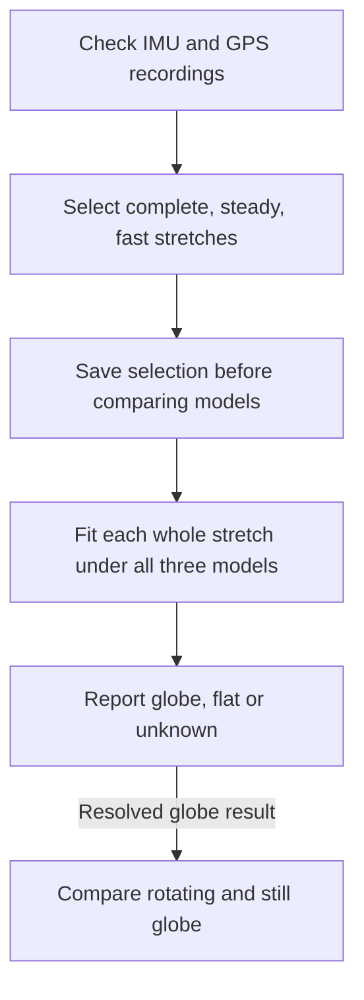

# Local Level Lab

**Can aircraft motion measurements distinguish a globe from a flat surface—and, if they
favor a globe, show whether it rotates?**

Local Level Lab analyzes NASA airborne survey recordings to investigate that question.
The data come from professional inertial equipment and GPS receivers aboard research aircraft.
A proposed crowdsourced experiment using smaller, less expensive instruments is secondary work.
The code, selection criteria and analysis records are open for review.

An **IMU (inertial measurement unit)** measures turning and acceleration. Its gyroscopes
measure how it turns; its accelerometers measure forces associated with gravity and motion.
GPS records where the aircraft went and when.

## The idea

An aircraft staying level over a globe must gradually turn as it follows the curved surface:
the direction of local down changes along its route. At 900 km/h, that curvature corresponds
to roughly eight degrees of turning per hour. Earth's rotation adds a different contribution.
An IMU can measure both, alongside ordinary aircraft movements and instrument errors.

| Model | Predicted contributions |
|---|---|
| Rotating globe | Turning along the curved surface, Earth's rotation and aircraft maneuvers. |
| Still globe | Turning along the curved surface and aircraft maneuvers, without Earth's rotation. |
| Still flat disc | Aircraft maneuvers and changes of direction around the disc, without globe curvature or Earth's rotation. |

The first question is **globe, flat or unknown**. All three models are fitted together,
comparing the flat model with whichever globe model fits better. Rotation is reported only
after the shape comparison consistently favors a globe; that comparison reuses the globe fits.

A persistent gyro reading alone proves little. Instrument offsets, aircraft motion and
uncertain onboard corrections can imitate parts of the signal. Those effects must be
allowed fairly across all models. This tests the specified models, rather than every
possible description of a flat Earth.

## Primary work: NASA airborne data

These recordings supported NASA's Operation IceBridge lidar surveys of ice sheets,
glaciers and sea ice. LVIS, the Land, Vegetation, and Ice Sensor, measures laser returns
from the surface. GPS locates the aircraft and the IMU tracks its orientation so those
returns can become accurately positioned elevation maps. See [NASA's LVIS description](https://lvis.gsfc.nasa.gov/Home/index.html).

The raw recordings are source material underlying those finished survey products.
Independent checks showing that the finished maps are reliable also support confidence
in the source measurements together with their calibration and processing. Using the
same material to test Earth models still requires understanding its gyro corrections,
timing and uncertainty for this different purpose.

The ILVIS0 archive contains Applanix IMU recordings with embedded GPS. The reference
instrument is an airborne survey-grade POS AV 510, far more capable than a phone IMU.
Other configurations in the archive are decoded and assessed separately. Published
specifications do not establish every recording's remaining calibration error or processing.

The analysis preserves original measurements and timestamps, checks packet integrity,
and verifies units against the instrument's combined GPS/IMU navigation output. That
combined output supplies decoder checks and motion context, rather than independent
evidence about Earth's shape. The model fits use IMU increments and receiver positions.

The current selection requires **four continuous minutes** with every supported GPS
ground-speed reading at least **700 km/h**, plus limits on aircraft motion, gaps and
instrument changes. Selection is fixed before examining model preferences. Each whole
stretch is fitted jointly; shorter sections check consistency without becoming extra
flights or receiving separate calibration fits.

The [public selection record](docs/ilvis0-highspeed-segments-20261008/ELIGIBILITY.md)
links to every eligible interval and every file's screening outcome.
See the [methodology](docs/METHODOLOGY.md) for the reasoning and the
[archive guide](docs/ILVIS0.md) for instruments, decoding and remaining uncertainties.

## Current status

**As of 9 October 2026, the selected-stretch analysis is running.
No calibrated Earth-model conclusion has been established.**

- All **232 retained files** have been screened: **53 qualifying stretches, totaling
  424.3 minutes**. Some instrument streams overlap; these are not 53 independent flights.
- The six-recording refinement is complete: **40 of 72 model fits converged**.
  The other 32 did not establish convergence within the computational allowance.
  **Two recordings favored globe over flat, then rotating over still globe, under all
  four tested cases.** Four remained unresolved. All fits in the two resolved recordings
  touched assumed parameter limits, so those preferences need further checking.
  [Provisional pilot findings](docs/ilvis0-refinement-20261008/PROVISIONAL.md) explain the results.
- The larger analysis tests two processing assumptions: Earth's rotation was retained
  in the logged measurements, or a shared amount may have been removed onboard.
  Both allow a constant gyro offset of ±1 degree/hour. These are sensitivity assumptions,
  not measured drift or verified limits for every instrument.

**Converged** means the solver satisfied numerical stopping and stationarity checks.
It does not mean an Earth model has been demonstrated. An unresolved fit is not evidence
against its model. Shape remains unknown when required fits are unresolved or assumptions
give conflicting answers.

The [final summary](docs/ilvis0-highspeed-segments-20261008/FINAL_SUMMARY.md) will compare
convergence by model and processing assumption, characterize
fully converged versus unresolved stretches, and report shape and rotation separately.
Calibration, onboard processing and GPS uncertainty still need adequate support, followed
by independent validation of any scientific decision rule.

## Secondary work: a crowdsourced experiment

An Android app records an external WitMotion WT901-family IMU over Bluetooth, phone GPS
and flight details. The proposed protocol uses still measurements before and after flying,
secure mounting, and deliberate IMU reversals during suitable cruise periods. Reversals
help separate external rotation from instrument offsets.

The recording software and analysis tools are implemented. Real-device bench tests and
a validated passenger-flight procedure are still needed. Simulations have exposed difficulties
with wind, aircraft motion and changing instrument errors. NASA results cannot automatically
establish what consumer IMUs can measure.

See the [participant protocol](docs/PROTOCOL.md), [instrument tests](docs/BENCH.md) and
[validation guide](docs/VALIDATION.md). Follow airline rules and crew instructions.
Uploading requires consent to public release; read the [privacy policy](PRIVACY.md).

## Explore or contribute

[Developer setup](docs/DEVELOPMENT.md) covers the app, Python analysis and upload server.
[Contributing](CONTRIBUTING.md) explains how to help. Reviews of the physics, statistics,
instrument behavior and explanations are welcome.

Code uses AGPL-3.0-or-later. Published participant recordings use CC0; third-party data
retain their own terms. See [data licensing](DATA_LICENSE.md).
Local Level Lab is an [Ars Astronomica](https://arsastronomica.com) project.
