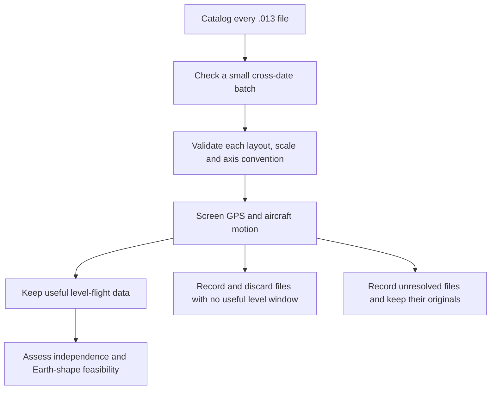

# Acquiring and decoding the airborne IMU archive

**The completed high-speed analysis favors globe in 12 stretches and flat in none;
all 12 globe results also favor rotation.** Another 41 comparisons lack finished
calculations. See the [findings and source tracks](ilvis0-highspeed-segments-20261008/FINDINGS.md).
Those unfinished calculations do not provide equal support for flat Earth.

The [complete-stretch scope](ilvis0-highspeed-segments-20261008/README.md) selects every
supported interval lasting at least four minutes with receiver ground speed at least 700 km/h
throughout. A versioned inventory records files, exact UTC times, speed and exclusions before
fitting. Whole stretches are primary joint fits; shorter sections check consistency with the
same parameters. These criteria do not establish model separation. See the
[shared methodology](METHODOLOGY.md).

NASA's [ILVIS0 archive](https://nsidc.org/data/ilvis0/versions/1) contains Applanix recordings
from survey aircraft. An inertial measurement unit (IMU) measures motion using gyroscopes
and accelerometers. These `.013` files record small **changes in angle and velocity**;
dividing an increment by its measured integration interval gives a rate-equivalent value.
They also contain GPS receiver sentences and the instrument's fused navigation solution.
The latter combines measurements with a navigation model and is not independent evidence
for Earth's shape or rotation.

## Instrument quality

These are professional airborne survey systems. The validated reference identifies POS AV
510, IMU8 and 200 Hz. Applanix's [historical FAQ](https://www.applanix.com/pdf/faq_pos_av_rev_2a.pdf)
describes specially selected LN200ROM units for the 510; an LN-200-family identification is
therefore likely, rather than proven by the type byte. That family uses three fiber-optic
gyroscopes and three silicon accelerometers. [Manufacturer description](https://www.northropgrumman.com/what-we-do/mission-solutions/assured-navigation/ln-200s-inertial-measurement-unit/navigating-mars)

Applanix publishes **0.02°/√hour noise and 0.10°/hour attitude drift** for POS AV 510 relative
system performance. The drift figure is not a verified raw-gyro bias specification for this
recording. Published post-processed attitude accuracy is likewise fused navigation performance.
[POS AV specifications](https://www.applanix.com/pdf/posav_specs_1212.pdf)
This instrument class is suitable for investigating slow turning at degrees per hour.
Survey-grade hardware is a strength of the analysis; unfinished optimization is currently
the main reason comparisons cannot be reported. The archive also contains other IMU types
and POS AV 610 configurations. Their identities and conversion checks are kept separate,
rather than assigning the POS AV 510's exact specifications to every file.

**Current modeling order:** compare the globe family with the flat-disc candidate first;
report rotating-versus-still diagnostics only if that shape comparison consistently favors
the globe under every tested assumption. The completed six-file sensitivity check uses constant
gyro-offset allowances of ±0.1 and ±1 degree/hour. These are calibration hypotheses,
not measured drift or guaranteed limits. The historical ±20 degree/hour allowance was a
broad stress test. Constant offset, random noise and time-varying drift are different errors.
The [refinement record](ilvis0-refinement-20261008/README.md) explains the numerical checks,
public performance context and completed pilot. The completed all-stretch extension uses two primary
cases at ±1 degree/hour, with Earth-rate removal fixed at zero or fitted; its ±0.1 sensitivity
is deferred. All three models are fitted together, with shape interpreted first and rotation
reported only after a resolved globe result. Reports state which model fits better;
a validated statistical significance level has not yet been assigned.

The supplied 14 April 2009 ATM sample now passes an empirical physical-decoder check.
Its six signed integers represent velocity X/Y/Z followed by angle X/Y/Z. The recovered
scales agree with `2^-14` metres/second per count and `2^-18` radians per count. The check
estimates scales before comparing with those values, tests every axis/sign mapping, and
holds out successive halves of the recording. Accelerometer comparison accounts for
gravity in the aircraft frame. No fitted validation offset is removed from exported data.
See the [measured results](ilvis0-physical-validation-20261007/README.md).

The public [Applanix interface document](https://asapdata.arc.nasa.gov/share/ASF_Applanix/POSv6_User_ICD.pdf)
supplies structural reference information, rather than an authoritative scale table for this
older unit. The observed angle and velocity increments are distinct from the finished
navigation output. "Raw" describes that measurement stream, not a guarantee that the
electronics applied no calibration or filtering. Ordinary noise filtering can preserve
slow turning; automatic zeroing, high-pass filtering or explicit Earth-rate subtraction
can remove it. A successful fit does not establish which corrections were used.
The [manufacturer's filtering explanation](https://www.analog.com/en/resources/app-notes/an-688_0.html)
illustrates the general distinction; it does not identify an Applanix filter.

The remaining instrument questions concern bias/scale corrections, Earth-rate compensation,
coning/sculling, exact filtering, automatic zeroing, lever arms, mounting and physical latency.
They are investigated through recorded settings, matched processing cases and producer
documentation. They do not make professional survey data equivalent to uncharacterized
phone data, and the archive results do not establish consumer-IMU performance.

## What the pipeline keeps

The catalog contains **326 `.013` downloads**, with roughly **3.97 GiB** of reported data,
dated 14 April 2009 through 20 September 2017. CMR sizes are rounded MiB, so HTTP lengths
and SHA-256 checks verify downloads. Filename tokens explicitly identify three ATM and ten
LVIS entries; the others remain unclassified. Instruments are never equated by flight date.
Only actual HTTPS download paths ending `.013` are selected. JPS and `.031` are outside scope.



Acquisition uses a geometry-only rule, fixed before model-dependent gyro analysis. A useful
window needs at least 60 uninterrupted seconds after ten-second boundary buffers, speed
at least 50 m/s, vertical speed at most 1.5 m/s, course change at most 0.05 degrees/second,
roll at most five degrees, and valid synchronized GPS/navigation with no context gaps above
two seconds. A no-level rejection also requires at least 95% valid motion/GPS context;
incomplete coverage and unsupported time mappings remain unresolved. This is a retention
rule, not scientific eligibility. The known sample climbs
and maneuvers and supplies no qualifying window under it.

Each catalog item has a stable task ID and durable ledger status: pending, retained,
discarded with no level window, unresolved, invalid input, failed, or authentication required.
Discarded files retain hashes, URLs, validation/motion reports and reasons. **All unresolved
originals are kept**, following the latest retention instruction. Only newly
acquired files inside the pipeline's marked directory can be removed; supplied originals
and historical evidence are untouched. Retained originals are compressed without changing
their bytes. Qualifying IMU windows preserve raw integers and physical values.

## Commands and recovery

Use the existing Python environment. Run from the repository root; keep at most two total
CPU threads. These commands are ordinary acquisition/decoding, not simulation campaigns.

```sh
env PYTHONPATH=analysis OPENBLAS_NUM_THREADS=2 OMP_NUM_THREADS=2 MKL_NUM_THREADS=2 /home/sweisman/venv/bin/python -m lll.ilvis0_acquisition catalog --output /tmp/ilvis0-catalog --quiet
```

The catalog command writes a complete CSV and metadata snapshot before any download.
Omit `--quiet` to display filenames, dates, URLs and reported sizes. `--start` and `--end`
restrict dates. The repository snapshot is in `docs/ilvis0-physical-validation-20261007/catalog/`.

```sh
env PYTHONPATH=analysis OPENBLAS_NUM_THREADS=2 OMP_NUM_THREADS=2 MKL_NUM_THREADS=2 /home/sweisman/venv/bin/python -m lll.ilvis0_acquisition batch --catalog docs/ilvis0-physical-validation-20261007/catalog/catalog.json --output data/ilvis0-ready --reference /home/sweisman/Downloads/ILVIS0_gyro_54935_atm_applanix_14Apr09.013
```

The first batch selects at most six files by explicit stream tokens and date diversity.
Earthdata's standard `.netrc` entry is supported; `--prompt` requests credentials securely
in a local terminal. For a single setup usable across unattended resumes, generate an
[Earthdata user token](https://urs.earthdata.nasa.gov/documentation/for_users/user_token)
and run this locally:

```sh
env PYTHONPATH=analysis /home/sweisman/venv/bin/python -m lll.ilvis0_acquisition configure-auth
```

It uses a hidden token prompt and exclusively creates a private, mode0600 `.netrc`. An
existing credential file is never overwritten. The only intentional credential storage is
this explicitly configured standard Earthdata file, outside reports and the repository.
Never paste credentials into a chat, source file or manifest. TLS
verification stays enabled. Authentication failures pause the batch instead of trying the
entire archive. Individual transient failures retry and leave recoverable partial files.
The `download` command can also select one unambiguous `--filename` from a catalog.

Rerun the identical batch command to resume. Verified completed tasks are skipped,
append-only records are fsynced, incomplete final appends are preserved before repair,
and a process lock prevents duplicate workers. `status.json` reports progress; `inventory.json`
tracks every catalog item. The manifest freezes sources, screen policy, runtime and catalog.
After a source change, use a new marked corpus directory rather than mixing results.
Once at least two dates independently pass compatibility, `--full` makes all catalog items
available to the same single-file-at-a-time worker. Each file is checked independently.

The URLs are HTTPS links to protected data. S3 also requires authentication and an authorized
AWS environment in `us-west-2`; NSIDC directs local-computer users to HTTPS. See its
[access guide](https://nsidc.org/data/user-resources/help-center/accessing-nsidc-daac-s3-data-aws-cli).
No cloud instance, AWS credential inspection, paid compute or S3 dependency is needed here.

If a catalog file was already downloaded through a browser, `--input-dir ~/Downloads`
checks that **exact catalog filename** without listing unrelated files. `--local-only`
imports available files without authentication or network and leaves others pending.
Supplied originals are never deleted by that import path.

```sh
env PYTHONPATH=analysis OPENBLAS_NUM_THREADS=2 OMP_NUM_THREADS=2 MKL_NUM_THREADS=2 /home/sweisman/venv/bin/python -m lll.ilvis0 decode --input /home/sweisman/Downloads/ILVIS0_gyro_54935_atm_applanix_14Apr09.013 --output /tmp/ilvis0-decoded
env PYTHONPATH=analysis OPENBLAS_NUM_THREADS=2 OMP_NUM_THREADS=2 MKL_NUM_THREADS=2 /home/sweisman/venv/bin/python -m lll.ilvis0 screen --output /tmp/ilvis0-decoded
```

Decode writes a gzip CSV of raw/physical IMU increments, fused navigation CSV, reconstructed
GPS bytes, checksum-tested GPS sentences/fixes, a compressed original and provenance reports.
Unsupported configurations retain raw values without guessed physical conversion. Invalid
outer framing, checksums or truncation fail; the parser never repairs or resynchronizes.
Timestamp reversals, rate changes, missing intervals and status problems are flagged. A
gap's elapsed time is never assigned to a single IMU increment. There is no science interpolation.

## Flight speed and measured performance

The signal caused by travelling over a curved surface grows approximately in proportion to
ground speed. As an illustrative spherical calculation, speeds of 100, 150 and 200 metres per
second produce local-level tilt rates of about 3.2, 4.9 and 6.5 degrees per hour. The actual
calculation uses latitude, altitude and north/east velocity, and projection onto the mounted IMU
axes matters. Earth's rotation has a separate latitude/orientation dependence.

The local follow-up reports these predicted scales for every geometry-selected window alongside
speed range, duration and heading coverage. It validates physical units separately for each
instrument configuration, then characterizes quantization and observed gyro variation after
averaging over one, ten and sixty seconds. That variation includes aircraft motion and vibration;
it is not automatically the IMU's intrinsic noise. Small random noise does not remove an unknown
constant bias or compensate for poor heading coverage. No significance threshold is inferred
from manufacturer specifications.

The follow-up uses only retained originals, without new downloads, and records a separate
source/environment freeze in `data/ilvis0-followup-20261007/`. Its launcher is
`analysis/tests/ilvis0_followup_worker.py`; completed per-file reports allow interruption-safe
resumption. The original screening ledger remains unchanged.

That follow-up has completed: 80 candidate files, 35 newly classified no-level files and
153 still blocked by navigation alignment. Four candidate files pass physical units checks,
providing about 32 minutes of qualifying data. Candidate window speeds range from about
140 to 256 m/s, with predicted horizontal transport of 4.5–8.3 degrees/hour. Measured variation
among minute-averaged body-axis readings remains comparable or larger in several axes, because
aircraft motion is included. See the [performance and compatibility results](ilvis0-followup-20261007/README.md).

A separate [IMU21 and alignment assessment](ilvis0-imu21-assessment-20261007/README.md)
has completed over all 233 preserved originals. Of 98 IMU21 files, 71 pass per-file physical
checks. Three of six exact configurations reproduce both selected dates; requiring both that
configuration check and a file's own check yields 24 exported candidate files and about
168 minutes. Including the earlier IMU8 candidates, 28 files provide about 200 minutes across
potentially overlapping instrument streams. The IMU21 scales are 2^-28 radians per count and
0.3048*2^-21 metres/second per count; these are empirically supported, not a manufacturer table.

GPS-only screening finds potential stretches in 84 of the 153 unresolved files. Internal
navigation uncertainty can be considerably smaller than the broad fine-alignment flag's
bound, but its accuracy is not independently demonstrated. Those stretches do not prove
level attitude or usable gyro orientation. All 153 remain scientifically unresolved;
all 233 originals remain preserved, and the scientific acceptance rules are unchanged.

The subsequent [keep/discard review](ilvis0-retention-84-20261007/README.md) resolved storage
decisions for the 84 GPS-promising, alignment-blocked files: keep 83 and remove one verified
byte-identical duplicate. All 83 keepers have at least a minute of uninterrupted raw IMU
data inside the GPS stretches; 22 also have a minute compatible with fused motion limits.
Those diagnostic spans do not prove independent orientation or become scientific windows.
The other 61 remain useful for investigation, with level-flight recovery still uncertain.
Their [completed motion examination](ilvis0-motion-61-20261007/README.md) reproduced all
earlier instantaneous checks exactly. In 53 files, measuring course rate over 2–12 seconds
permits a diagnostic minute while keeping roll, climb and speed limits unchanged. Almost
98.5% of the original course-rate excursions lasted less than a second. Three other files
also have roll/climb interruptions, one has disagreement between navigation and receiver
track, and four yield no minute at the tested resolutions. All 61 remain kept; neither
averaging nor fused-navigation agreement demonstrates independent orientation or proves
that short corrections are noise. Scientific eligibility remains unchanged.

A [six-file IMU6 cross-date study](ilvis0-imu6-cross-date-20261007/README.md) supports a gyro
increment scale of 0.4 arcsecond/count. Two of three configurations reproduce the earlier
axis mapping on a second date. The third changes mapping; within-file chronological checks
support the scale on all six, without erasing the failed cross-date result. No complete
accelerometer conversion passes, and these are relative mappings to fused navigation rather
than independent mounting measurements. No physical decoder is applied across the IMU6 corpus.
The [motion-timescale controls](ilvis0-course-controls-20261007/README.md) detected all five
substantial recorded ground-track changes at each tested interval, but showed that a real
one-second course correction can be hidden by a 12-second regression. This supports further
motion modeling, not changing the acceptance gate merely to recover more windows.

The [installation/clock follow-up](ilvis0-installation-clock-20261007/README.md) now explains
the axis change with logged mounting-angle candidates. Header intervals fluctuate around
5 milliseconds; treating those fluctuations as sensor integration changes produces most of
the earlier vertical acceleration mismatch. An explicit fixed-period hypothesis supports
the 3.38e-5 m/s/count velocity increment scale in all six files, reducing vertical disagreement
by 76–595 times. One gyro half still narrowly fails the unchanged scale tolerance. Both rate
normalizations remain recorded; no automatic conversion is enabled until integration-clock
semantics are established. Legacy setting offsets remain inferred, and fused navigation
agreement does not establish processing independence.
Removing the duplicate reclaimed about 6.66 MiB. Current storage is **232 originals**:
80 earlier candidates and 152 alignment-blocked files. Earlier evidence keeps its historical
counts; future selection must honor the new cleanup journal and canonical-file mapping.

A subsequent continuity check covered all 326 files. Three overlapping pairs are identical
copies; one verified partial overlap adds 16.7 seconds but still provides no qualifying window.
No candidate level-flight stretch can currently be lengthened across files. Separated recordings
are kept separate, and simultaneous different IMUs are never joined into one measurement.

## What remains before an Earth-shape comparison

Level-flight footage or instrument quality does not by itself establish an independent
shape measurement. We still need to understand recorded gyro corrections and reconstruct
orientation/motion without treating fused navigation as independent truth. Permanently
mounted survey equipment lacks the participant's deliberate IMU reversals; these data need
their own nuisance and identifiability analysis.

The authorized follow-up is a separate, bounded empirical feasibility/comparison study:
at most six geometry-selected retained files, at most 24 optimizer starts including interrupted
starts, and 200 evaluations per start. That initial plan required suitable motion geometry
and observations separate from the finished navigation solution.
If those prerequisites fail, the output is a documented blocker, rather than a forced fit.
No synthetic threshold transfers to these data, and no calibrated model winner can be claimed.
The original reference is unsuitable under the acquisition window rule. The six-file trial
found 272 seconds of qualifying flight in the 16 April 2009 ATM file, with independently
supported physical decoding, and 354 seconds in a 2015 POS AV 610 file whose physical decoding
was unresolved in that initial trial. Three further trial files were unresolved and preserved.
The initial archive-wide pass produced 18 retained files, 58 confirmed no-level rejections and
250 unresolved cases. The completed timestamp follow-up then brought the current totals to
**80 candidate files, 93 discarded files and 153 unresolved originals** at that stage.
The later duplicate removal leaves 152 unresolved originals and 232 originals overall.
The subsequent IMU21
assessment raised supported physical candidates to 28, totaling about 200 minutes across
instrument streams. Other configurations still failed some checks. No Earth-model fit had
run at that stage. Subsequent studies completed the comparisons summarized at the top of
this guide. The [initial screening record](ilvis0-physical-validation-20261007/README.md)
and [completed follow-up](ilvis0-followup-20261007/README.md) preserve that sequence.

## The route from decoded measurements to the proposed experiment's principle

The shared principle is to ask whether the IMU's measured rotation contains the small,
predictable contributions from Earth's rotation and motion over its surface, after allowing
for aircraft motion and instrument error. These archival recordings can address that question,
but do not inherit the passenger experiment's controls or calibration.

The next development stage should use a small set selected by recorded geometry and data
completeness, before inspecting Earth-model residuals. Preserve raw angle and velocity increments,
logged installation epochs and timing uncertainty. Compare accumulated increments over supported
intervals as well as rate estimates; this tests clock assumptions without selecting the
normalization separately for whichever model fits better. Determine which onboard corrections
are documented and which remain hypotheses. Looking for an expected Earth-rate component is
a diagnostic, not by itself proof that no Earth-dependent processing occurred.

Then build an archival observation model that separates aircraft rotation, sensor bias,
mounting uncertainty and the predicted Earth contributions. Embedded GPS supplies trajectory
context; ground track does not supply body heading, and acceleration during flight does not
give gravity direction alone. Fused Group-1 attitude and gyro outputs can check the decoder
and describe motion, but cannot supply the independent rotation being tested. Any unavoidable
use of fused orientation must be explicit. Test how its model dependence affects the
comparison. GPS-derived coordinates and their geometric assumptions also
need an explicit treatment under each candidate model.

Before fitting measured gyro outcomes, calculate whether the recorded changes in heading,
speed and latitude separate each model pair after those nuisance freedoms are included.
A fixed heading with an unknown constant bias may leave an Earth signal unidentifiable,
regardless of IMU quality. Actual route changes and any independently identified stationary
or taxi intervals may provide controls; do not invent reversals or smooth away short motion.
Preserve useful pairwise comparisons when a complete three-model conclusion is unavailable.

Only informative, independently supported measurements advance to the bounded exploratory
comparison above. If motion or processing remains inseparable from the predicted signal,
report that specific limitation and the additional observation needed. A later scientific
decision requires its own frozen assumptions, calibration and independent validation.

The first [archival observation check](ilvis0-observation-20261007/README.md) has now completed
on the six existing IMU6 representatives. It prepared 2,930 complete diagnostic seconds and
tested geometry using primary-receiver coordinates, without fused attitude or gyro rates.
The 26 October 2010 route retains predicted pairwise separation after constant/linear bias
removal, including 2.50 degrees/hour RMS for still globe versus disc, under an idealized
independent aircraft-motion correction. Freely varying gain/mount tangents remove nearly
all separation, but that unbounded local projection is not a fit with realistic calibration
bounds. No Earth fit had been attempted at that stage. The joint raw-IMU/GPS model and
later fit studies followed; the passages below describe that development history.

That [joint motion model](ilvis0-forward-20261007/README.md) is now implemented and its
deterministic controls pass. It integrates full-rate finite rotations and rotated specific
force, predicts navigation under explicit candidate geometries, and requires calibration
bounds/processing assumptions as inputs. Six strict source scans prepared all 2,930 previous
complete seconds; 2,928 have real GPS observations near both endpoints, with their timing
offsets preserved. No fused attitude/gyro entered the observations and no Earth fit ran.
The subsequent [recorded-data modeling](ilvis0-exploratory-20261008/README.md)
used the six real IMU/GPS recordings with stated correction, calibration and timing
allowances, preserving unfinished calculations. The completed
[pilot](ilvis0-refinement-20261008/PROVISIONAL.md) and
[53-stretch study](ilvis0-highspeed-segments-20261008/FINDINGS.md) followed.
Current numerical work is the separately frozen
[matched solver trial](ilvis0-solver-trial-20261010/README.md). The earlier records below
remain a history of completed stages, not the current work queue.

The [bounded estimator](ilvis0-estimator-20261007/README.md) is now implemented. Five analytic
software controls recover bias, effective orientation, gain and timing under known conditions,
and expose orientation/bias ambiguity when both are free. Fifteen focused tests pass.
Pair-specific bounded tangent profiles and the empirical prerequisite/start ledger are
implemented; no observed Earth fit ran. Local tangents are not a guarantee of separation
between two independently fitted nonlinear models. Archive calibration, processing, clock
and validated receiver covariance remain prerequisites before the bounded empirical fit.
The subsequent [receiver/processing audit](ilvis0-processing-v2-20261007/README.md) recovers
2,968 dated primary-receiver positions with reported north/east/vertical uncertainty. Their
units and epochs reproduce the receiver's GPS sentences. It also reassembles 29,681 binary
RT17/RT27 survey envelopes, whose measurement payloads remain unconverted. Four receiver
streams are complete; two have incomplete final packet/record tails, retained without repair.
All six outer source/hash audits pass. Sixteen focused tests pass. Reported sigmas are not
independently validated full covariance, and no Earth fit or scientific promotion occurred.

The [satellite-measurement audit](ilvis0-gnss-v2-20261007/README.md) then decodes
19,699 epochs and 603,603 signal measurements at 10Hz in the two RT17 streams and 5Hz
in the four RT27 streams, plus 326 GPS ephemeris packets. All six source/frame/record
sequence checks pass; 31 focused tests pass. Of 29,567 GPS sky-angle comparisons, 29
flagged cases are one satellite reporting zero angles for 29 seconds. All measurements
and prior tail failures remain preserved. RT17 filtering flags do not establish code
smoothing; RT27's explicit smoothing flags are clear. No positioning or Earth fit ran at
that decoder stage.

The separately frozen [GPS-only reconstruction](ilvis0-position-20261007/README.md) now
solves all 2,968 previously selected epochs with two fixed code-range methods: 5,936 primary
solutions and 24 displaced-start checks all converge. Recorded broadcast orbits, satellite
clocks, signal travel time, ionospheric coefficients and an altitude-supported atmospheric
approximation supply the corrections. No fused navigation enters the reconstruction. The
first receiver position only initializes the solver; reported positions are comparison
products, not constraints. Twenty-eight focused tests pass (13 new, 15 preceding).

L1 RMS differences from the same receiver reports range from 0.17–0.85m per horizontal
axis and 0.46–1.79m vertically. Those are consistency differences, not measured errors.
Dual-frequency differences are larger; unknown signal biases and shared processing prevent
an accuracy ranking. Lag-one difference correlations span 0.20–0.89, and mean vertical
method offsets span about -1.61 to +2.97m. Formal covariance remains uncalibrated.
All232originals remain, with zero Earth fits or scientific eligibility changes.

The subsequent [correlated-error sensitivity analysis](ilvis0-gps-sensitivity-20261007/README.md)
evaluates 13 fixed assumptions over both methods and the same 2,968 epochs. Formal cross-axis
terms, exponential temporal correlation, common offsets and linear drift propagate through
mean positions and fixed 2/6/12/30/60-second kinematic windows. There is no residual-based
selection or automatic smoothing choice. The assumed scales are not calibrated bounds.
Twenty-three focused tests pass (ten new, thirteen preceding). Persistent errors can prevent
mean-position uncertainty from averaging away; a short-motion control loses over 100 times
its acceleration response in a 60-second window. No observed Earth fit or gate change ran.
The [joint IMU/GPS controls](ilvis0-correlated-controls-20261007/README.md) now propagate
that full assumed covariance through five analytic calibration/timing fixtures. Numerical
recovery is reported separately from local precision; unresolved directions have no finite
marginal precision assigned. GPS offset/drift controls reproduce initial position/velocity
shifts. Thirty-three distinct focused tests pass (eight new, ten preceding sensitivity,
fifteen estimator). This uses two-second toy translation data, not archived IMU fits or
measured IMU6 performance. Supported processing, calibration, mounting and physical
integration/latency bounds remain necessary before observed Earth fitting.

The [duration/rotation controls](ilvis0-excitation-20261007/README.md) now compare2/20/60s
analytic trajectories with/without a one-second0.1deg pitch correction under three fixed
GPS-error assumptions. All18trajectory checks and4single-parameter gyro-bias/timing fits
pass;11focused tests pass. Joint eight-parameter precision improves with duration but
gyro-gain information remains weak. Covariance-dependent rank changes are preserved and
are not interpreted as improved data. No archived IMU was fitted or downsampled. The
[IMU6 evidence matrix](ilvis0-excitation-20261007/INSTRUMENT_EVIDENCE.md) distinguishes
empirical units/mappings from unsupported processing, noise/drift bounds and physical
clock/latency conventions. The subsequent
[information stability diagnostics](ilvis0-information-20261007/README.md) compare four
central derivative steps on those same18fixtures and retain every result. Smooth
reference information separates numerical rank from useful local sensitivity relative
to the declared bounds. The reference penalty and GPS covariances are explicitly
assumed, not measured calibration or confidence intervals. Independent
instrument-specific support remains necessary; the empirical Earth-fit evidence gate
is unchanged.

The [instrument documentation review](ilvis0-instrument-evidence-20261007/README.md)
now finds a published POS AV510/IMU-6 association with tactical-grade Litton-200
hardware. This supports an LN-200-family inference for the six files; it does not
identify their exact installed variants. The review associates existing source
hashes/dates with logged POS system identifiers and firmware/ICD revisions, and
prepares an unsent technical question packet. Public descriptions establish a
sensor-correction stage before navigation integration but not the legacy Group4
logging tap point. Generic NovAtel LN-200 output scales differ from our empirical
Applanix encoding; they are not substituted into the decoder. Recorded correction,
calibration, integration-clock/latency and mounting support remain unresolved.

The [legacy-record search](ilvis0-legacy-records-20261008/README.md) obtained no
manual/calibration record matching those V5 revisions. NSIDC's current guide
supports raw/unprocessed Level-0 archive provenance but does not define onboard
Group4 corrections. A verified support route and concise unsent request are ready.
No external message or empirical fit ran during that document search. An inquiry has
since been sent and NSIDC is asking the producers for documentation. Analysis continues
while that reply is pending; the absence of a matching proprietary manual does not prevent
using the independently decoded measurements with stated processing cases.

The same evidence characterizes the six prepared stretches from embedded GPS: median heights
6.35–11.93 km above mean sea level and median ground speeds 482–937 km/h. These are not
whole-flight or above-terrain summaries. Earlier candidate windows cover both low and high
altitudes. Slower flight reduces the predicted curvature rate, while Earth rotation itself
does not depend on aircraft speed. Instrument streams and uncertainty must remain distinct.
